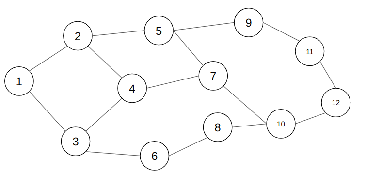

## Graph_DS

Graph_DS is a C-based implementation of essential graph traversal algorithms, involving Breadth-First Search (BFS) and Depth-First Search (DFS). This project demonstrates fundamental graph data structure operations and traversal techniques using the graph below.



### Features
* Graph Traversal Algorithms:
    * BFS (Breadth-First Search)
    * DFS (Depth-First Search)
* Modular structure with separate implementation ```graph.c``` and header ```graph.h``` files for reusability.

### File Structure
* graph.h - Header file containing function prototypes and definitions.
* graph.c - Implementation of graph data structure and utility functions.
* BFS_implementation.c - BFS traversal implementation.
* DFS_implementation.c - DFS traversal implementation.
* README.md - Project documentation.

## Getting Started

### Perequisites
To compile and run the code, ensure you have:

    - A C compiler (e.g., GCC)
    - A command-line interface (CLI)

### Compilation
Use the following command to compile the code:

1. ```gcc -o BFS_implementation BFS_implementation.c graph.c```
2. ```gcc -o DFS_implementation DFS_implementation.c graph.c ```

Execution
Run the compiled program:
1. ```./DFS_implementation ```
2. ```./BFS_implementation ```
